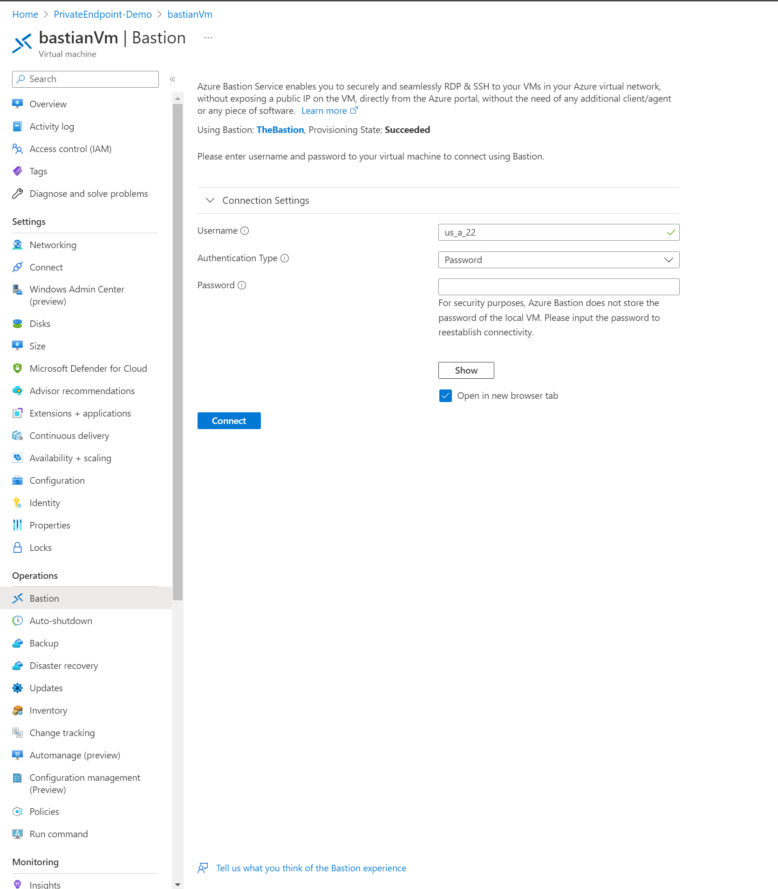

# Private Endpoint with Bastion for verification

This repo shows how to set up a private endpoint for Azure Storage and check it using Azure Bastion.


Azure Bastion is useful in PCI-DSS scenarios when you do not want your developer's machines to become a 'connected system.'

## Setup

1. Clone/Fork this repo
2. Create an RG in Azure and note down the name
3. Create a GitHub secret holding an Azure Service Principal following this guide: <https://github.com/Azure/actions-workflow-samples/blob/master/assets/create-secrets-for-GitHub-workflows.md> giving it access to the RG in step 2. Give it the name AZURE_CREDENTIALS.
4. Create a GitHub secret called PASSWORD with your password to connect to the VM. The username is us_a_22.
5. Once the GitHub Action is done, then locate the 'bastianVm' and connect to it using the bastian:

6. If you then open Powershell and type

```powershell

> nslookup {storage}.blob.core.windows.net
```

Then you should see an IP address in the subnet range.

## Actions

[](https://github.com/fredrkl/private-endpoint-setup/actions/workflows/create-infra.yml)
